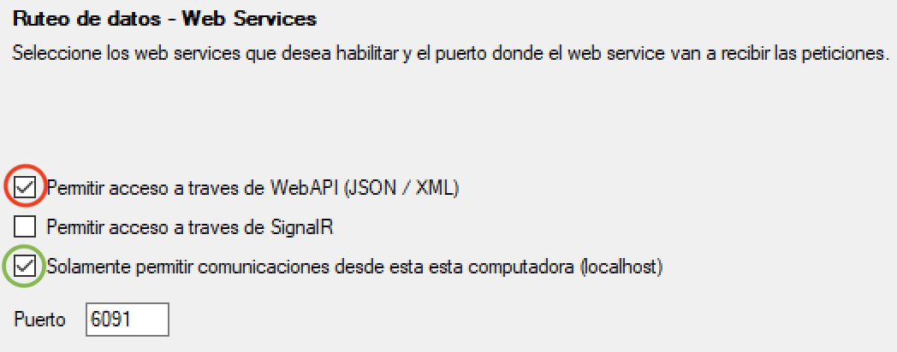

# Bolsuite Python Connector
bolsuite.python obtiene las cotizaciones del mercado de capitales desde [Bolsuite](https://www.facebook.com/groups/274656386254166) dejando disposible la informacion realtime para ser utilizada desde cualquier programa Python.

Los metodos que provee bolsuite.python se dividen en 3 grupos:
- Paneles
- Profundidad de mercado (Nivel 2)
- Historico intradiario

Los tres grupos retornan pandas dataframes lo cual permite manejar la informacion de manera rapida, sencilla y en un "Pythonic way".

-----
## Guia Rapida

La aplicacion cuenta con un solo modulo que se llama `connector` el cual permite acceder a toda la informacion.

	import bolsuite as bs

	bsc = bs.Connector()
	# Si bolsuite no se esta ejecutando en la misma computadora o esta configurado 
	# en un puerto diferente se puede indicar en la URL como parametro
	# bsc = bs.Connector(base_url="http://10.20.43.20:6091")

	# Obtener todos los indices
	bsc.indices()

	# Obtener un indice filtrado por nombre
	bsc.indices(ticker='MERVAL')

	# Obtener todas las acciones lideres
	bsc.bluechips()

	# Obtener todas las acciones lideres filtrada por vencimiento
	bsc.bluechips(settlement='Spot') 

	# Obtener una accion del panel de lideres filtrada por nombre
	bsc.bluechips(ticker='PAMP')

	# Obtener una accion del panel de lideres filtrada por nombre y vencimiento
	bsc.bluechips(ticker='PAMP', settlement='24hs')

	# Obtener todas las acciones del panel general
	bsc.general_board()

	# Obtener todas las acciones del panel general filtrada por vencimiento
	bsc.general_board(settlement='48hs') 

	# Obtener una accion del panel general filtrada por nombre
	bsc.general_board(ticker='LOMA')

	# Obtener una accion del panel general filtrada por nombre y vencimiento
	bsc.general_board(ticker='LOMA', settlement='Spot')

	# Obtener todos los cedears
	bsc.cedear_stocks()

	# Obtener todos los cedears filtrados por vencimiento
	bsc.cedear_stocks(settlement='24hs') 

	# Obtener un cedear filtrado por nombre
	bsc.cedear_stocks(ticker='C')

	# Obtener un cedear filtrado por nombre y vencimiento
	bsc.cedear_stocks(ticker='C', settlement='48hs')

	# Obtener todos los bonos
	bsc.government_bonds()

	# Obtener todos los bonos filtrados por vencimiento
	bsc.government_bonds(settlement='Spot') 

	# Obtener un bono filtrado por nombre
	bsc.government_bonds(ticker='AO20')

	# Obtener un bono filtrado por nombre y vencimiento
	bsc.government_bonds(ticker='AO20', settlement='24hs')

	# Obtener todas las letras
	bsc.government_short_term_bonds()

	# Obtener todas las letras filtradss por vencimiento
	bsc.government_short_term_bonds(settlement='48hs') 

	# Obtener una letra filtrada por nombre
	bsc.government_short_term_bonds(ticker='S11M0')

	# Obtener una letra filtrada por nombre y vencimiento
	bsc.government_short_term_bonds(ticker='S11M0', settlement='Spot')

	# Obtener todas opciones de un subyacente
	bsc.options(underlying_asset='GGAL')

	# Obtener todas las cauciones
	bsc.repos()

	# Obtener todas las cauciones filtradas por dia
	bsc.repos(days=7)

	# Obtener todas las cauciones filtradas por moneda
	bsc.repos(currency='ARS')

	# Obtener una caucion filtrada por dia y por moneda
	bsc.repos(days=1, currency='USD')

	# Obtener todas las obligaciones negociables
	bsc.corporate_bonds()

	# Obtener todas las obligaciones negociables por vencimiento
	bsc.corporate_bonds(settlement='24hs') 

	# Obtener una obligacion negociable filtrada por nombre
	bsc.corporate_bonds(ticker='BFCPO')

	# Obtener una obligacion negociable filtrado por nombre y vencimiento
	bsc.corporate_bonds(ticker='BFCPO', settlement='48hs')

    # Obtener todas los plazos por lotes (Version minima requerida: Bolsuite 2.20)
    bsc.term_by_batches()
   
    # Obtener todas los plazos por lotes por vencimiento (Version minima requerida: Bolsuite 2.20)
    bsc.term_by_batches(settlement='529')

    # Obtener un plazo pot lote filtrado por nombre (Version minima requerida: Bolsuite 2.20)
    bsc.term_by_batches(ticker='AY24')

    # Obtener un plazo pot lote filtrado por nombre y vencimiento (Version minima requerida: Bolsuite 2.20)
    bsc.term_by_batches(ticker='AY24', settlement='630')

	# Obtener todos los ADRs
	bsc.adrs()

	# Obtener un ADR filtrado por nombre
	bsc.adrs(ticker='GGAL.O')

	# Obtener todos los pares de divisas
	bsc.currency_pairs()

	# Obtener un par de divisas filtrado por nombre
	bsc.currency_pairs(ticker='USD-ARS')

	# Obtener todos los commodities
	bsc.commodities()

	# Obtener un commodity filtrado por nombre
	bsc.commodities(ticker='Brent Oil') # (Hasta Bolsuite 2.12)
	bsc.commodities(ticker='CL=F') # (Version minima requerida: Bolsuite 2.20)

    # Obtener todos los indices mundiales (Version minima requerida: Bolsuite 2.20)
    bsc.world_indices()
   
    # Obtener un indice mundial filtrado por nombre (Version minima requerida: Bolsuite 2.20)
    bsc.world_indices(ticker='^DJI')

    ## Obtener todos los futuros de indices mundiales (Version minima requerida: Bolsuite 2.20)
    bsc.world_indices_futures()

    # Obtener un futuro de indice mundial filtrado por nombre (Version minima requerida: Bolsuite 2.20)
    bsc.world_indices_futures(ticker='ES=F')

	# Obtener todos los activos del panel personal
	bsc.personal_portfolio()

	# Obtener un activo del panel personal filtrado por nombre
	bsc.personal_portfolio(ticker='COME')

	# Obtener la profundidad de mercado de los activos seleccionados
	bsc.level_2_quotes(tickers=['GFGC102.JU','GFGC120.JU','GGAL'])

	# Obtener el historico intradiario de GGAL en formato tick
	bsc.intraday_quotes(ticker='GGAL')

	# Obtener el historico intradiario de GGAL agrupado cada 5 minutos
	bsc.intraday_quotes(ticker='GGAL', timeframe=5)

	# Obtener el historico intradiario de GGAL agrupado cada 5 minutos 
	# ordenado en forma descendente
	bsc.intraday_quotes(ticker='GGAL', timeframe=5, sort=0)

	# Obtener la ultima hora del historico intradiario de GGAL agrupado 
	# cada 5 minutos ordenado en forma descendente
	bsc.intraday_quotes(ticker='GGAL', timeframe=5, sort=0, filter=60)

	# Obtener la ultima hora del historico intradiario de GGAL agrupado 
	# cada 5 minutos ordenado en forma descendente llenando el OHLC con 
	# el ultimo cierre si no existe cotizacion en el periodo
	bsc.intraday_quotes(ticker='GGAL', timeframe=5, sort=0, filter=60, fillgap=1)

## Instalacion

Instalar ``bolsuite.python`` usando ``pip``:

    $ pip install git+https://github.com/crapher/bolsuite.python --upgrade --no-cache-dir

## Configuracion de Bolsuite

Para que ``bolsuite.python`` pueda acceder a la informacion provista por Bolsuite se debe agregar el tilde (circulo rojo) a la opcion **Permitir acceso a traves de WebAPI (JSON/XML)**

**Nota:** En caso de que Bolsuite se ejecute en una maquina distinta a la que se esta utilizando ``bolsuite.python``, se debe sacar el tilde (circulo verde) de la opcion **Solamente permitir comunicaciones desde esta computadora (localhost)**

## Requerimientos

* [Python](https://www.python.org) >= 3.6+
* [Pandas](https://github.com/pydata/pandas) >= 1.0.0
* [Numpy](http://www.numpy.org) >= 1.18.1
* [requests](http://docs.python-requests.org/en/master/) >= 2.21.0

## Legal

**bolsuite.python** es distribuido bajo licencia **Apache Software License**. Para mas detalles mirar el archivo [LICENSE.txt](./LICENSE.txt).

## Contacto

Cualquier sugerencia que tengas, dejame un mensaje

**Diego A. Degese**